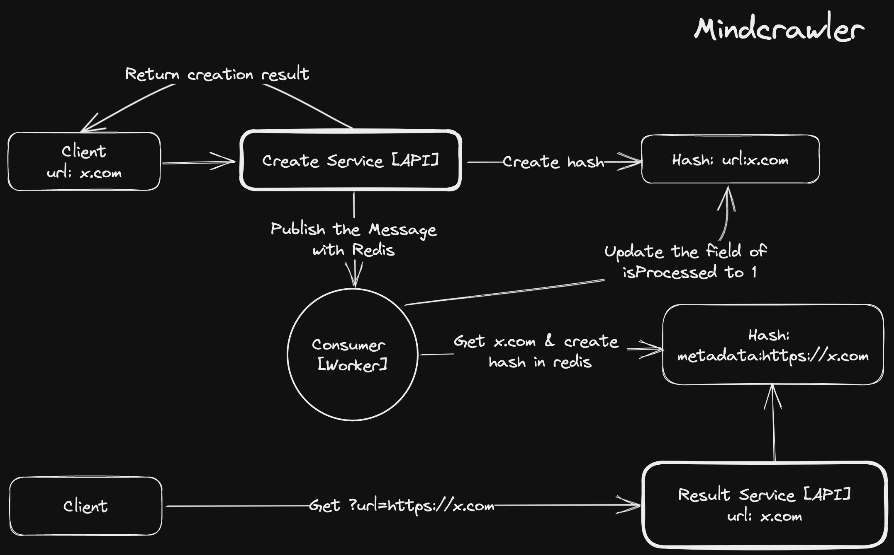

# mindcrawler

It's a simple crawler that crawls the web and stores the results in a Redis datastore.

There is two different application for the project. One of them is an API with Flask. One endpoint receives and processes the address from which the user requested the crawling, and the other provides the crawling result to the user. The other application scans the requested address and saves the result in Redis.

Flow:

1. Post the seed url with `/create` endpoint
2. Write the seed url to a hash in Redis
3. Publish message the seed url to a channel named `crawling-channel`
4. The workers subscribe to the channel and start crawling the urls
5. Crawling the urls and storing title and description metadata in Redis
6. Get the result with `/result` endpoint

Assumptions:

- The seed url is a valid url
- Only domain of the seed url is crawled, incl. subdomains (e.g. `https://amazon.com` and `https://aws.amazon.com`)
- No crawling for the seed url's path
- The seed url is crawled only once
- If the seed url is crawled again, the result is updated (overwrited)

Stack:

- Python
- Flask
- Redis
- Docker
